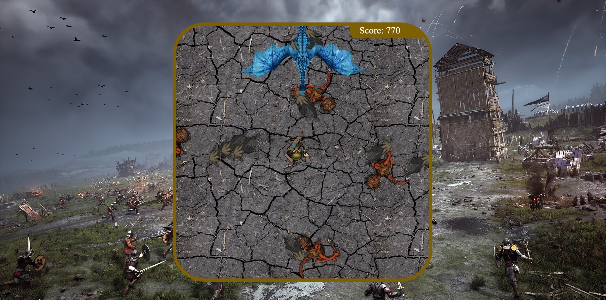

# SODIA GAME

## Description

Game's purpose and description:

In a time of blood and fire, the kingdom of Sodia is about to be overrun by the worst kind of enemies. 

Are you ready to save the kingdom?

instructions below:

* User has to defend the kingdom by shooting the enemies.
* If the enemies reach the user, user dies. 
* When user kills an enemy, user earns 10 or 20 points, depending on the type of enemy.
* If user reaches 500 points user will have the mission to kill the beast  called Big Dragon, apart from killing the enemies at the same time.

## User stories MVP

* Press START button to start the game.
* Use LEFT / RIGHT / UP / DOWN arrows to move the player, so turns around (north, south, west, east)  and click space to shoot.
* Enemies appear from north, south, east and west.
* User shoots to the 4 directions.
* if BabyDragon is killed user wins.
* if enemies touch the user, user loses
* Enemies have differences in terms of their "value : Some enemies give the user  10 points, others 20 points, and the last one (the dragon) will give 100 points.
* user can see a start screen with instructions and end screen when user wins or loses. 

## User stories Backlog
 Upcoming developments!

* User can choose other weapons (arrows, stones, etc.) or
* Add more than 1 enemy dragon on the board, at least 1 per direction.
* Put a maximum number of bullets and if the user runs out of bullets, the user dies.
* User can move/walk around the board in different directions.
* User can choose between 3 levels on the start page 

## File structure

- <code>game.js</code>: contains all the elements for the game to work. Methods: start(), \_update()
- <code>scripts.js</code>: contains all the DOM manipulation code to start the game.
- <code>player.js</code>: contains the class player.
- <code>enemy.js</code>: contains the class enemy
- <code>assets.js</code>: contains all the images and audios 
- <code>styles.css</code>:
- <code>index.html</code>: contains the contents of the lose/win/start page.

## Useful links

<!-- When you finish, add these links and commit -->

- [Presentation Slides](https://docs.google.com/presentation/d/17o8pfU952duM68wNuS3tq6jQ3p9ZCGPL/edit?usp=sharing&ouid=103696499090412195476&rtpof=true&sd=true)
- [Deployed game](https://monicamargo37.github.io/SODIA_Shooter-Game/)
